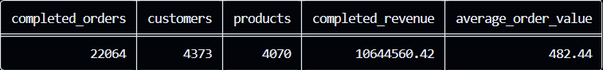
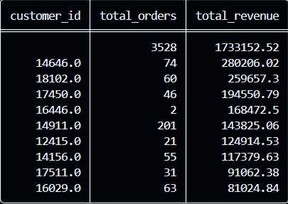
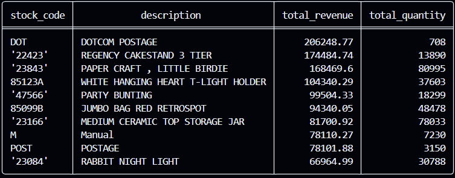
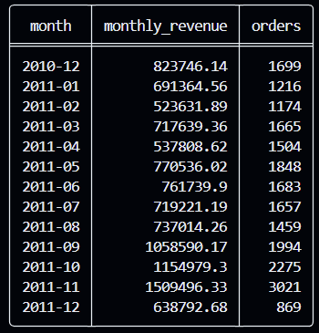
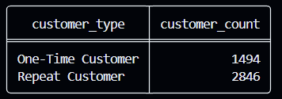

# 📊 SQL Sales Analysis

> End-to-end retail sales analysis using SQL and SQLite

---

## 🎯 Project Overview

This project analyzes retail transaction data using SQL and SQLite to identify:

- Sales trends
- Customer behaviour
- Product performance
- Revenue patterns
- Cancellation impact
- Business insights

The project demonstrates practical SQL skills including aggregations, filtering, CTEs, subqueries, and window functions.

---

## 🔄 Project Workflow

```text
                ONLINE RETAIL DATASET
                         │
                         ▼
                ┌─────────────────┐
                │ Data Preparation│
                └────────┬────────┘
                         │
              ┌──────────┴──────────┐
              │                     │
              ▼                     ▼
       Clean Data Fields      Calculate Revenue
              │                     │
              └──────────┬──────────┘
                         ▼
                  ┌─────────────┐
                  │ sales_clean │
                  └──────┬──────┘
                         │
                         ▼
                ┌─────────────────┐
                │   SQL ANALYSIS  │
                └────────┬────────┘
                         │
       ┌─────────────────┼─────────────────┐
       │                 │                 │
       ▼                 ▼                 ▼
   CUSTOMER           PRODUCT            TIME
   ANALYSIS           ANALYSIS          ANALYSIS
       │                 │                 │
       └─────────────────┼─────────────────┘
                         │
                         ▼
                ADVANCED ANALYSIS
                         │
                         ▼
                BUSINESS INSIGHTS
                         │
                         ▼
                  KPIs & RESULTS
```

---

## 🎯 Business Questions

The analysis answers questions such as:

- What is the total revenue generated?
- What is the average order value?
- How many customers and products are there?
- Which countries generate the most revenue?
- Which products generate the most revenue?
- Which products sell the highest quantities?
- Who are the highest-value customers?
- What percentage of customers are repeat customers?
- How does revenue change over time?
- Which months generate the highest sales?
- How much revenue comes from repeat customers?
- How concentrated is revenue among top customers?
- What is the impact of cancelled orders?

---

## 📦 Dataset

The project uses the **Online Retail** dataset containing transactional retail sales data.

### Dataset Fields

| Field | Description |
|---|---|
| `InvoiceNo` | Invoice/order identifier |
| `StockCode` | Product identifier |
| `Description` | Product description |
| `Quantity` | Number of units purchased |
| `InvoiceDate` | Transaction date and time |
| `UnitPrice` | Price per unit |
| `CustomerID` | Customer identifier |
| `Country` | Customer country |

The raw dataset is excluded from GitHub using `.gitignore`.

---

## 🧹 Data Preparation

A cleaned analytical table called `sales_clean` was created from the raw transaction data.

### Data Flow

```text
Raw Transactions
       │
       ▼
Clean text fields
       │
       ▼
Calculate revenue
       │
       ▼
Identify cancelled invoices
       │
       ▼
sales_clean
```

Revenue was calculated as:

```text
quantity × unit_price
```

Cancelled invoices were identified using invoice numbers beginning with `C`.

For completed-sales analysis:

```sql
WHERE invoice_no NOT LIKE 'C%'
```

Customer-level analysis excludes missing or blank customer IDs when analysing customer behaviour.

---

## 🗂️ Project Structure

```text
SQL-Sales-Analysis/
│
├── data/
│
├── database/
│   └── sales_analysis.db
│
├── sql/
│   ├── 01_database_setup.sql
│   ├── 02_basic_analysis.sql
│   ├── 03_customer_analysis.sql
│   ├── 04_product_analysis.sql
│   ├── 05_time_analysis.sql
│   ├── 06_advanced_analysis.sql
│   └── 07_business_insights.sql
│
├── screenshots/
│   ├── executive_kpis.png
│   ├── top_customers.png
│   ├── top_products_revenue.png
│   ├── monthly_revenue.png
│   └── customer_segments.png
│
├── DATA_DICTIONARY.md
├── .gitignore
└── README.md
```

> The raw dataset and SQLite database are kept locally and excluded from GitHub because of their size.

---

# 🔎 Analysis Modules

## 01 — Database Setup

Creates the raw and cleaned analytical tables and prepares the dataset for analysis.

## 02 — Basic Analysis

Answers fundamental sales questions including:

- Total revenue
- Total orders
- Average revenue
- Quantity sold
- Number of products
- Number of customers
- Countries served

## 03 — Customer Analysis

Analyzes:

- Top customers
- Customer order frequency
- One-time vs repeat customers
- Customer value segments
- Customer lifetime value
- Revenue concentration

## 04 — Product Analysis

Analyzes:

- Top products by revenue
- Top products by quantity
- Average selling price
- Product order frequency
- Product revenue contribution
- High-revenue products

## 05 — Time Analysis

Analyzes:

- Monthly revenue
- Monthly orders
- Day-of-week performance
- Hourly sales
- Monthly revenue growth
- Monthly AOV

## 06 — Advanced Analysis

Uses CTEs and window functions for deeper analysis including:

- Customer lifetime value
- Customer revenue ranking
- Top products by country
- Repeat customer revenue
- Revenue concentration

## 07 — Business Insights

Combines the analysis into business-focused metrics covering:

- Cancellation impact
- Cancellation rate
- Average order value
- Average items per order
- Revenue per customer
- High-revenue products
- Executive KPIs

---

## 📊 Executive KPI Snapshot

| KPI | Value |
|---|---:|
| Completed Orders | **22,064** |
| Customers | **4,373** |
| Products | **4,070** |
| Completed Revenue | **£10,644,560.42** |
| Average Order Value | **£482.44** |
| Repeat Customers* | **2,845** |
| One-Time Customers* | **1,494** |
| Cancelled Orders | **3,836** |

\*Based on customers with usable customer IDs.

---

## 💡 Key Business Insights

### 💰 Revenue Performance

**£10.64M** in completed revenue was generated across **22,064 completed orders**, with an average order value of **£482.44**.

### 👥 Customer Behaviour

Among customers with usable customer IDs:

- **2,845 repeat customers**
- **1,494 one-time customers**

### 📅 Sales Trend

**November 2011** was the strongest sales month:

**£1.51M revenue | 3,021 orders**

### 🏆 High-Value Customers

Customer **14646** generated:

**£280,206.02 | 74 orders**

Customer **16446** generated:

**£168,472.50 | 2 orders**

This represents a high-value customer pattern worth further investigation.

### 🛍️ Product Performance

**REGENCY CAKESTAND 3 TIER**

**£174,484.74** revenue

**PAPER CRAFT, LITTLE BIRDIE**

**£168,469.60** revenue

### 🔄 Cancellation Analysis

The dataset contains:

**3,836 cancelled orders**

compared with:

**22,064 completed orders**

> **Note:** Completed-sales analysis excludes invoices beginning with `C`, which represent cancelled transactions.

---

## 📸 Analysis Results

### Executive KPIs



### Customer Analysis



### Product Analysis



### Time Analysis



### Customer Segmentation



---

## 🧠 SQL Techniques Demonstrated

- Aggregations using `SUM()`, `AVG()`, `COUNT()`
- Filtering with `WHERE`
- Grouping with `GROUP BY`
- Conditional logic using `CASE`
- Common Table Expressions (CTEs)
- Subqueries
- Window functions
- `RANK()`
- `LAG()`
- Customer segmentation
- Revenue and order analysis
- Time-series analysis using `strftime()`
- Cancellation analysis
- Revenue concentration analysis

---

## 🛠️ Tools & Technologies

- SQL
- SQLite
- Python / Pandas
- Git
- GitHub
- GitHub Codespaces

---

## 📚 Documentation

- [Data Dictionary](DATA_DICTIONARY.md)

---

## 🚀 Future Enhancement

The next phase of the project will be an interactive **Power BI dashboard** built from the cleaned sales dataset.

---

## 👤 Author

**Ayush Kumar**

Computer Science — BITS Pilani